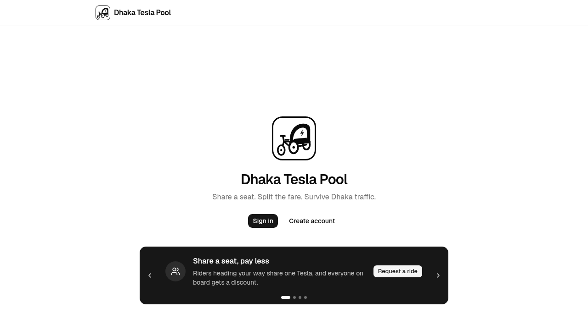
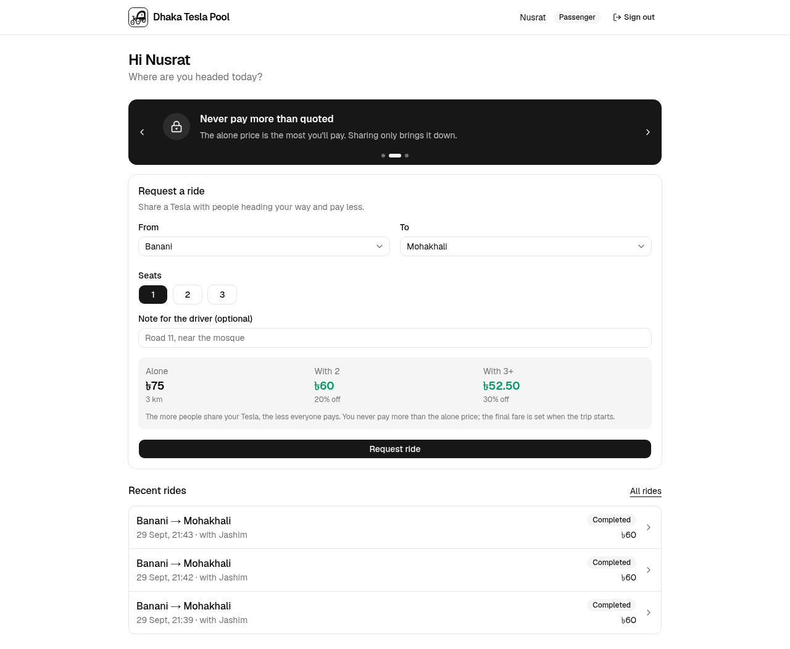
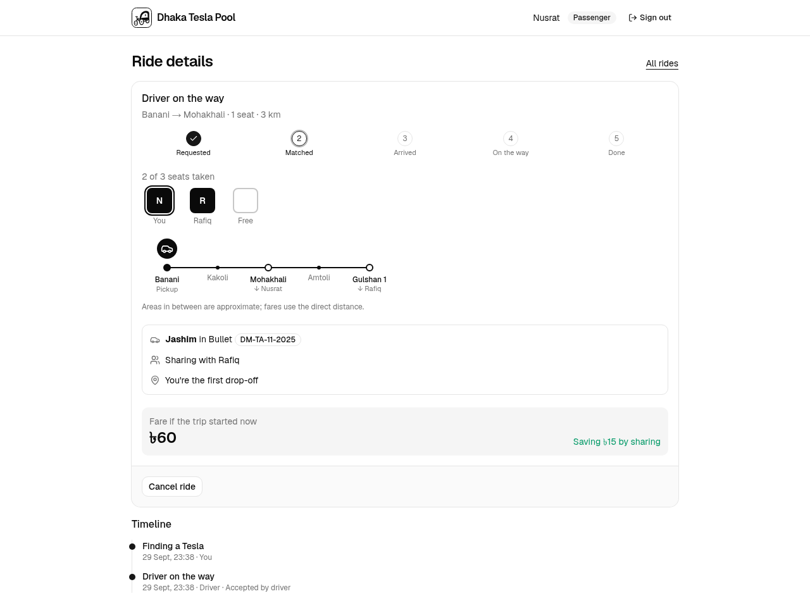
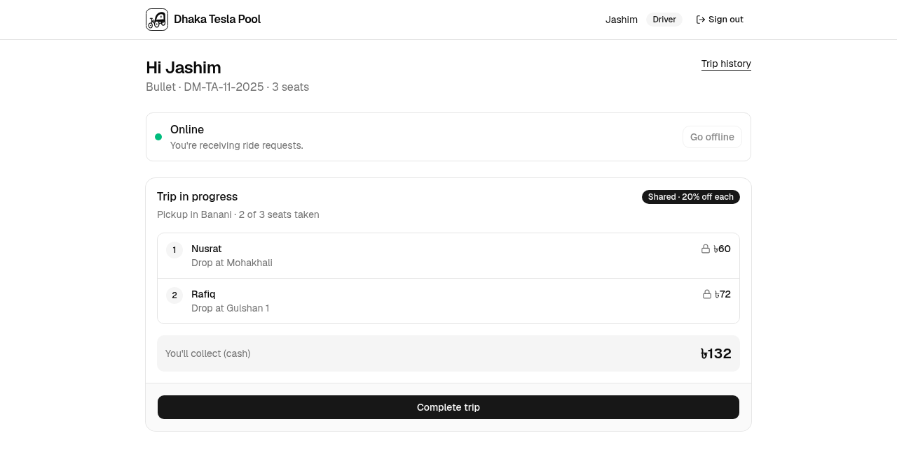
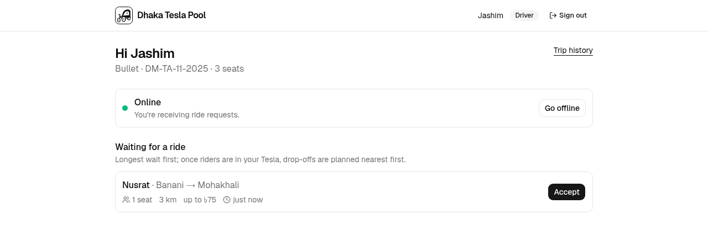
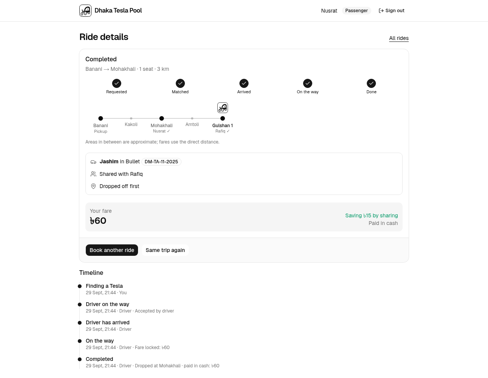
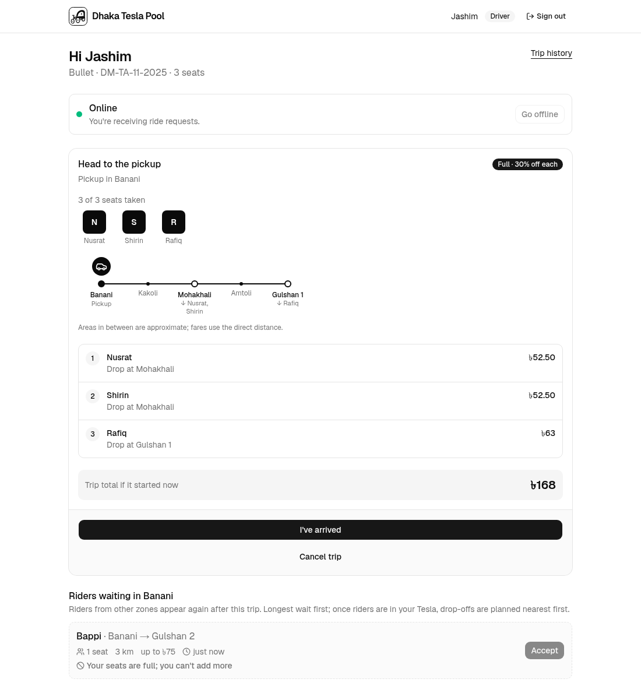
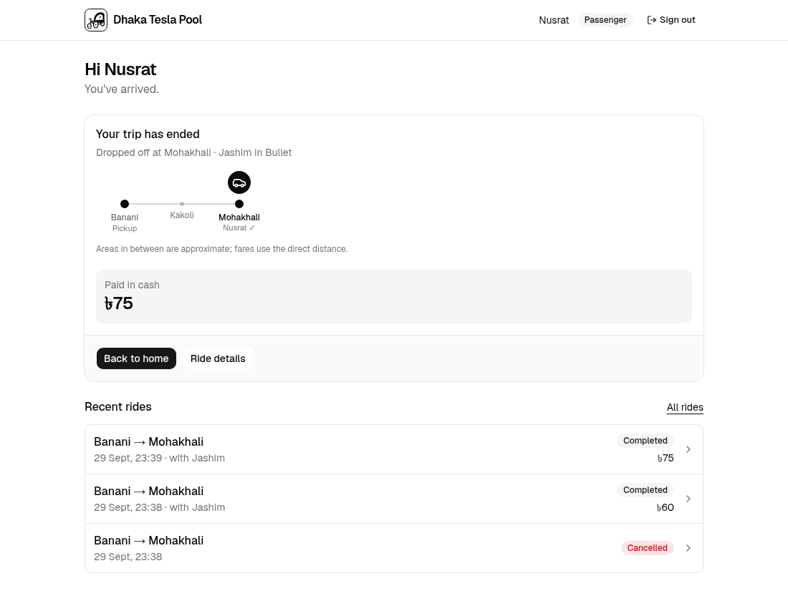
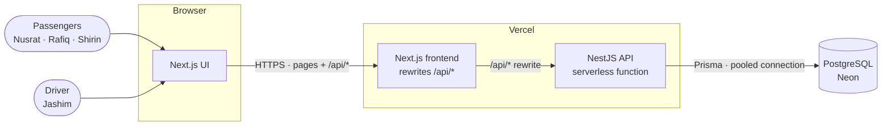
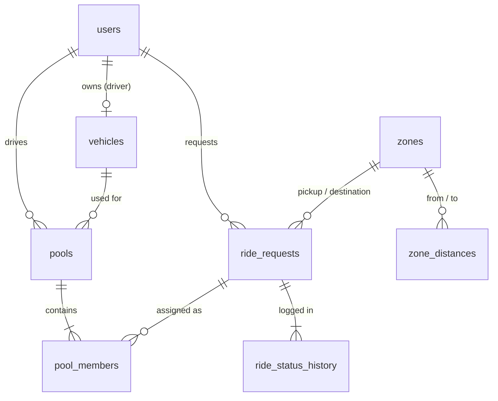

<div align="center">


# Dhaka Tesla Pool

**Share a seat. Split the fare. Survive Dhaka traffic.**

A ride-pooling MVP: passengers heading the same way share one electric three-wheeler (a "Tesla"), and everyone on board pays less.

[**Live app**](https://dhaka-tesla-pool-wheat.vercel.app) · [**Demo video**](https://drive.google.com/file/d/1A2XfGu7rc3Rxl2PCY5M7Rk5GHTbw2pTG/view?usp=sharing) · [Presentation](https://drive.google.com/file/d/1ewULzsUbCdC6Ld_ixve4RoGorPUE_7Gy/view?usp=sharing) · [API docs](https://dhaka-tesla-pool-backend.vercel.app/api/docs) · [Architecture](docs/architecture.md) · [ERD](docs/erd.md)


</div>

---

## Contents

- [Demo video](#demo-video)
- [Presentation](#presentation)
- [The problem](#the-problem)
- [Features](#features)
- [Screenshots](#screenshots)
- [Live demo & credentials](#live-demo--credentials)
- [Architecture](#architecture)
- [Database](#database)
- [Tech stack & why](#tech-stack--why)
- [Project structure](#project-structure)
- [Getting started](#getting-started)
- [Environment variables](#environment-variables)
- [Testing](#testing)
- [API overview](#api-overview)
- [Key decisions & trade-offs](#key-decisions--trade-offs)
- [Known limitations](#known-limitations)
- [Next improvements](#next-improvements)
- [Git workflow](#git-workflow)
- [AI usage](#ai-usage)

---

## Demo video

📹 **Watch the walkthrough video:** https://drive.google.com/file/d/1A2XfGu7rc3Rxl2PCY5M7Rk5GHTbw2pTG/view?usp=sharing

[](https://drive.google.com/file/d/1A2XfGu7rc3Rxl2PCY5M7Rk5GHTbw2pTG/view?usp=sharing)

---

## Presentation

📑 **Slides used in the video (architecture, database, lifecycle, race-condition handling):** https://drive.google.com/file/d/1ewULzsUbCdC6Ld_ixve4RoGorPUE_7Gy/view?usp=sharing

---

## The problem

Jashim drives **Bullet**, a 3-seat electric three-wheeler in Dhaka. Most trips leave seats empty, while passengers leaving the same area at the same time each pay for a whole vehicle.

**Nusrat** (Banani → Mohakhali) and **Rafiq** (Banani → Gulshan 1) are both leaving Banani. Riding together fills more of Bullet, costs each of them less, and earns Jashim more per trip.

The hard parts are the ones a real ride-pooling service has to get right:

- **Matching:** who can share a trip without a long detour.
- **Capacity:** Bullet must **never** carry more than 3, even when two people grab the last seat at the same instant.
- **Fair fares:** each rider pays for their own distance, less a sharing discount.
- **Lifecycle:** requests, cancellations and trip states must stay consistent.

Every assumption made along the way is written down in [docs/assumptions.md](docs/assumptions.md).

## Features

**Passenger**
- Sign up / sign in with an httpOnly cookie session.
- Pick pickup and destination zones and seats (1–3), and see three prices before booking: alone, shared by two (20% off) and full Tesla (30% off).
- New requests **automatically join** a compatible open pool (same pickup, seats free, detour ≤ 2 km).
- Live ride page (polled every 3 s): progress steps, driver and plate, co-riders by first name, drop-off order, and the projected fare, which is locked when the trip starts.
- **Seat boxes:** one box per seat in the Tesla, the same for everyone in the pool: filled when booked, empty when free, freed again when someone gets off.
- **Trip line:** pickup, the areas passed on the way (e.g. Banani → Kakoli → Mohakhali) and every drop-off, with the Tesla drawn where it is now.
- Cancel before the trip starts. History, ride details with a timeline, and "Same trip again".

**Driver**
- Go online/offline; see waiting requests only while online.
- Accept a request (starts a pool) or add a fitting request to the open pool. Requests that can't join are still listed with the reason (e.g. "Your seats are full; you can't add more").
- Arrive → start (fares lock) → **drop passengers off one by one** in drop-off order (each pays cash and their ride completes; the last drop-off ends the trip), or **Finish trip** to drop off everyone left at once. Cancel is possible before the start.
- Current trip view with seat boxes, the trip line, each rider's fare, and cash collected so far. Trip history.

**Platform**
- Seat capacity enforced by a row lock **and** a database `CHECK` constraint.
- One active ride per passenger and one active pool per driver, enforced by partial unique indexes.
- A single state machine for ride transitions; every change is written to a status history.
- Consistent error shape with a request ID, validation on every input, Helmet headers, rate-limited sign-in.
- Swagger docs, health check, Docker Compose, CI on every pull request.

## Screenshots

| Home | Request a ride (three prices up front) |
|---|---|
|  |  |

| Nusrat, pooled with Rafiq: seat boxes and trip line | Jashim has dropped Nusrat off; Rafiq is next |
|---|---|
|  |  |

| Driver sees a waiting request | Nusrat's completed ride with timeline |
|---|---|
|  |  |

| Bullet is full: a 4th rider is listed but can't be added | Passenger's home right after the drop-off |
|---|---|
|  |  |

## Live demo & credentials

| | URL |
|---|---|
| **App** | https://dhaka-tesla-pool-wheat.vercel.app |
| **API** | https://dhaka-tesla-pool-backend.vercel.app/api |
| **API docs (Swagger)** | https://dhaka-tesla-pool-backend.vercel.app/api/docs |
| **Health** | https://dhaka-tesla-pool-backend.vercel.app/api/health |

The story cast is seeded in every environment. The password is `tesla1234` for all of them.

| Who | Role | Email | Password |
|---|---|---|---|
| **Jashim** | Driver of Bullet (3 seats, `DM-TA-11-2025`) | `jashim@dhakatesla.test` | `tesla1234` |
| **Nusrat** | Passenger | `nusrat@dhakatesla.test` | `tesla1234` |
| **Rafiq** | Passenger | `rafiq@dhakatesla.test` | `tesla1234` |
| **Shirin** | Passenger | `shirin@dhakatesla.test` | `tesla1234` |

> **Try the story in separate browser profiles** (or one normal and one incognito window per person), because a session is one cookie per browser:
>
> 1. **Jashim** → Go online.
> 2. **Nusrat** → Banani → Mohakhali, 1 seat → Request ride.
> 3. **Jashim** → Accept Nusrat.
> 4. **Rafiq** → Banani → Gulshan 1 → he joins Bullet automatically. Both now see the 20% shared fare (৳60 and ৳72).
> 5. **Jashim** → I've arrived → Start trip (fares lock) → **Drop off** Nusrat at Mohakhali (৳60) → **Drop off** Rafiq at Gulshan 1 (৳72). The trip ends with ৳132 cash.
>
> Add **Shirin** before the start to fill Bullet: everyone's discount rises to 30%.

## Architecture



- **Browser → Next.js → NestJS → PostgreSQL.** The browser only talks to the frontend's domain. Next.js forwards `/api/*` to the API, so the auth cookie is first-party and no CORS is needed.
- **All business rules live in the backend.** The database is the last line of defence for anything that must never break (seat capacity, one active ride).
- **Modular monolith.** NestJS modules for auth, zones, fares, rides, pools and driver. No microservices, queues or caches: nothing in the MVP needs them.

More in [docs/architecture.md](docs/architecture.md): layers, auth flow, state machine, error handling and security.

### The last-seat race

Bullet has one seat left, and Nusrat and Shirin claim it at the same instant. Seat reservation runs in one transaction that first locks the pool row:

```sql
SELECT status, occupied_seats, capacity FROM pools WHERE id = $1 FOR UPDATE;
-- the second request waits here, then sees occupied_seats = 3 and is refused
```

A `CHECK (occupied_seats <= capacity)` constraint backs this up, so even a code path that forgot the lock cannot overbook. Locks are always taken pool → ride, so cancellations and joins cannot deadlock. The e2e suite races 8 passengers for 1 seat, five times over. See [architecture §8](docs/architecture.md#8-concurrency--data-consistency) for the options that were considered and what changes at scale.

## Database



| Table | Purpose |
|---|---|
| `users` | Passengers and drivers, bcrypt password hash, role, online flag |
| `vehicles` | A driver's Tesla and its seat capacity |
| `zones`, `zone_distances` | 14 Dhaka zones and a symmetric km table (no map API) |
| `ride_requests` | A passenger's trip request, its status and the solo fare estimate |
| `pools` | One shared trip: driver, vehicle, pickup zone, `occupied_seats ≤ capacity` |
| `pool_members` | Who is in a pool, drop-off order, when they were dropped off, and the full locked fare breakdown |
| `ride_status_history` | Every state change, who made it, and why |

Money is stored as **integer paisa**, and percentages as basis points. Full column list, constraints, indexes and a worked example: [docs/erd.md](docs/erd.md).

### Fare model

```
fare = (৳30 base + ৳15 × km) × seats − pool discount
discount (same for everyone on board, by passengers at the start):
    alone 0% · two 20% · three or more 30%
```

| Trip | Alone | Shared by 2 | Full Tesla (3) |
|---|---:|---:|---:|
| Nusrat, Banani → Mohakhali (3 km) | ৳75 | **৳60** | ৳52.50 |
| Rafiq, Banani → Gulshan 1 (4 km) | ৳90 | **৳72** | ৳63 |

Each rider pays for their **own** direct distance, never someone else's detour. The fare locks when the trip starts, so a passenger never pays more than the "alone" price shown before booking. Details and test cases: [docs/fare-model.md](docs/fare-model.md).

## Tech stack & why

| Area | Choice | Alternatives considered | Why it fits this MVP | What would make me switch |
|---|---|---|---|---|
| Frontend | **Next.js 16** (App Router), React 19 | Vite + React SPA | Required by the brief. Its rewrites give the browser a single origin for pages and API. | — (mandated) |
| Backend | **NestJS 12** (Node.js 24, ESM) | Express, Fastify | Modules, guards, pipes and DI give a clear place for auth, validation and business rules. | Only if cold-start size or raw throughput became the bottleneck (Fastify adapter first). |
| API style | **REST** + Swagger | GraphQL, tRPC | Rides and pools map cleanly to resources; state changes are explicit actions (`POST /rides/:id/cancel`). | Many clients needing different shapes of the same data → GraphQL. |
| Database | **PostgreSQL 17** | MySQL, MongoDB | Transactions, row locks, `CHECK` constraints and partial unique indexes are exactly what capacity safety needs. | Not for this domain. Add read replicas or partitioning before changing engines. |
| ORM | **Prisma 7** (driver adapter `pg`) | TypeORM, Drizzle, raw SQL | Type-safe queries, readable schema, first-class migrations; raw SQL where needed (`FOR UPDATE`). | Heavy hand-written SQL everywhere → Drizzle or Kysely. |
| Validation | **class-validator** DTOs + global `ValidationPipe` | Zod | The NestJS standard; unknown fields are rejected. | Sharing schemas with the frontend → Zod. |
| Auth | **JWT in an httpOnly cookie**, bcrypt | Server sessions, Auth.js, Clerk | No session store needed on serverless; the cookie isn't readable by JavaScript; `SameSite=Lax` blocks CSRF. | Social login, refresh tokens or revocation → a session store or an auth provider. |
| Data fetching | **TanStack Query** with 3 s polling | WebSockets, SSE | Caching and loading/error states for free; polling works on serverless and ride status changes only a few times per trip. | Many live screens or sub-second updates → WebSockets on a long-running server. |
| UI | **Tailwind CSS 4** + shadcn/ui | MUI, Chakra | Small, accessible components we own; a clean black-and-white theme. | A design system with its own tokens. |
| Tests | **Vitest** + Supertest | Jest | Fast, native ESM/TypeScript; e2e runs against a real PostgreSQL. | — |
| Lint / format | oxlint (backend), ESLint (frontend), Prettier | ESLint everywhere | oxlint is fast with type-aware rules; Next ships its ESLint config. | — |
| Hosting | **Vercel** (both apps) + **Neon** PostgreSQL, free tiers | Render, Railway, Fly.io | Free, deploys from GitHub, preview per branch; Neon's pooler suits serverless. | Cold starts or WebSockets needed → a long-running container (Fly.io, Render). |
| Local | **Docker Compose** | Dev containers | One command: database, migrations and seed, API and UI with health checks. | — |

## Project structure

```
dhaka-tesla-pool/
├── backend/                 NestJS API
│   ├── prisma/              schema.prisma + migrations
│   ├── scripts/             Swagger metadata generator
│   ├── src/
│   │   ├── auth/            sign-up/in, JWT cookie, guards, rate limit
│   │   ├── zones/           zones and distance lookup
│   │   ├── fares/           pure fare calculator (no DB access)
│   │   ├── rides/           passenger requests, cancel, history, state machine
│   │   ├── pools/           matching, seat reservation, drop-off planning
│   │   ├── driver/          online/offline, accept, arrive/start/complete
│   │   ├── common/          error filter, request ID, logging, decorators
│   │   ├── config/          environment validation
│   │   ├── database/        seed data (story cast, zones, distances)
│   │   └── health/          GET /api/health
│   └── test/e2e/            API tests against a real PostgreSQL
├── frontend/                Next.js app
│   └── src/
│       ├── app/             routes: /, (auth)/login|signup, passenger/*, driver/*
│       ├── components/      passenger/, driver/, ui/ (shadcn)
│       ├── hooks/           TanStack Query hooks per resource
│       └── lib/             API client, types, cross-tab auth sync
├── docs/                    architecture, assumptions, fare model, ERD, API, images
├── e2e/                     Playwright browser tests for the main flows
├── docker-compose.yml       postgres + migrate/seed + backend + frontend
└── .github/workflows/ci.yml lint, types, tests, build, Docker build
```

## Getting started

### Prerequisites

- **Docker** with Compose v2, for the one-command setup, **or**
- **Node.js 24** and npm 11, plus a PostgreSQL 17 (Docker is easiest) for running the apps directly.

### Option A: Docker (recommended)

```bash
git clone https://github.com/EsferSamiX/dhaka-tesla-pool.git
cd dhaka-tesla-pool
cp .env.example .env        # optional: the defaults work as they are
docker compose up --build
```

| Service | URL |
|---|---|
| App | http://localhost:3000 |
| API | http://localhost:4000/api |
| API docs | http://localhost:4000/api/docs |
| PostgreSQL | `localhost:5433` (user/password `tesla`) |

Compose starts things in order: `postgres` becomes healthy → `migrate` applies migrations and seeds the story cast, then exits → `backend` starts → `frontend` starts once the API's health check passes. The seed is idempotent, so restarting is safe.

Stop with `docker compose down`, or `docker compose down -v` to also delete the database.

### Option B: run the apps directly

```bash
# 1. Database only
docker compose up -d postgres

# 2. Backend (http://localhost:4000)
cd backend
cp .env.example .env
npm ci                      # also runs `prisma generate`
npm run db:deploy           # apply migrations
npm run db:seed             # zones, distances, Jashim/Nusrat/Rafiq/Shirin
npm run start:dev

# 3. Frontend (http://localhost:3000), in another terminal
cd frontend
cp .env.example .env.local
npm ci
npm run dev
```

### Migrations and seed

| Command (in `backend/`) | Does |
|---|---|
| `npm run db:migrate` | Create a new migration from `schema.prisma` changes (development) |
| `npm run db:deploy` | Apply pending migrations (CI, Docker, production) |
| `npm run db:seed` | Insert or update the 14 zones, the distance table and the story cast |

On Vercel, production deploys apply pending migrations automatically during the build; preview deploys don't, because they share the production database.

## Environment variables

Never commit real values. Each app has a `.env.example` with safe local defaults.

**Root `.env`** (Docker Compose, optional)

| Variable | Default | Purpose |
|---|---|---|
| `POSTGRES_USER` / `POSTGRES_PASSWORD` / `POSTGRES_DB` | `tesla` / `tesla` / `dhaka_tesla_pool` | Local database |
| `JWT_SECRET` | `dev-only-change-me` | Session signing key (local only) |
| `POSTGRES_PORT` / `BACKEND_PORT` / `FRONTEND_PORT` | `5433` / `4000` / `3000` | Host ports |

**`backend/.env`**

| Variable | Required | Purpose |
|---|---|---|
| `DATABASE_URL` | yes | Connection used by the app (Neon: the pooled URL) |
| `DIRECT_URL` or `DATABASE_URL_UNPOOLED` | for migrations | Direct connection for Prisma migrations (Neon provides `DATABASE_URL_UNPOOLED`) |
| `JWT_SECRET` | yes | In production, at least 32 characters; the public dev secrets are refused at startup |
| `PORT` | no | Defaults to `4000` |

**`frontend/.env.local`**

| Variable | Purpose |
|---|---|
| `API_URL` | Where `/api/*` is forwarded. Read **at build time** (`http://localhost:4000` locally, `http://backend:4000` in Compose). |

## Testing

```bash
cd backend
npm test             # unit tests: fares, matching, state machine, guards, config
npm run test:e2e     # API tests against the PostgreSQL in DATABASE_URL (seed it first)
npm run lint && npm run typecheck

cd ../frontend
npm run lint && npm run typecheck && npm run build
```

**Browser tests** (Playwright) drive the real UI against a running stack. Each test signs up its own people, so any database works, and cleans up its trips:

```bash
docker compose up -d --build --wait
cd e2e
npm ci
npx playwright install chromium   # or: PW_CHANNEL=chrome to use an installed Chrome
npx playwright test               # E2E_BASE_URL=… to test another deployment
```

| Browser test | Checks |
|---|---|
| `trip.spec.ts` | A full Tesla from Tejgaon: accept from the driver screen, two riders auto-join, seat boxes on all screens, 30% fares, drop-offs nearest first (the others are disabled), the first rider's "trip ended" card, Finish trip, End trip |
| `driver.spec.ts` | A 4th rider is listed as "Your seats are full" with Accept disabled; no new riders once boarding; going offline and online with a slow network never flashes an error |
| `passenger.spec.ts` | Alone / with 2 / with 3 prices; cancelling your own ride returns to booking without a "trip ended" card; a broken ride link shows "Ride not found" |
| `auth.spec.ts` | Show/hide password, wrong password, sign-in redirect, signing out in one tab signs out the others |

**67 unit and 59 e2e tests.** The e2e tests run through the real HTTP stack and database, and clean up after themselves. The behaviours the brief asks for:

| Required behaviour | Where it's tested |
|---|---|
| Bullet's capacity can never be exceeded | `pooling.e2e-spec.ts`: never more than 3; the DB `CHECK` rejects a direct overbooking |
| Two concurrent requests can't corrupt capacity | `pooling.e2e-spec.ts`: Nusrat vs Shirin for the last seat; 8 passengers × 1 seat × 5 rounds; driver-add vs passenger-join. `driver.e2e-spec.ts`: two drivers accepting one ride |
| Nusrat's and Rafiq's pooled fares | `fare.calculator.spec.ts` (F1–F12), `fares.e2e-spec.ts`, `driver.e2e-spec.ts`: locks ৳60 and ৳72 at the start |
| Invalid state transitions are rejected | `ride-state.spec.ts` (allowed and forbidden moves, final states), plus cancel after start, arrive/start out of order, and drop-offs before the start or out of order in the e2e tests |
| Users can't modify another user's ride | `rides.e2e-spec.ts`: another passenger gets 403 on view and cancel, and the ride is unchanged; role checks on passenger and driver routes |
| Cancellation rules hold | `rides.e2e-spec.ts`: cancel frees the seat, empties the pool, refuses after the start; `driver.e2e-spec.ts`: driver cancel sends riders back to waiting |

CI ([.github/workflows/ci.yml](.github/workflows/ci.yml)) runs all of this on every pull request: the API tests against a PostgreSQL service, and the browser tests against the full Docker Compose stack.

## API overview

REST, JSON, all under `/api`. Auth is the `token` httpOnly cookie. Interactive docs are at `/api/docs`; the full reference is in [docs/api.md](docs/api.md).

| Method | Path | Who | Purpose |
|---|---|---|---|
| `POST` | `/auth/signup` · `/auth/signin` · `/auth/signout` | Public / user | Account and session |
| `GET` | `/auth/me` | User | Current user (and vehicle) |
| `GET` | `/zones` | Public | The 14 zones |
| `POST` | `/fares/estimate` | Public | Alone / shared / full-Tesla prices |
| `POST` | `/rides` | Passenger | Request a ride (auto-joins a compatible pool) |
| `GET` | `/rides/active` · `/rides` · `/rides/:id` | Passenger | Current ride, history, details with timeline |
| `POST` | `/rides/:id/cancel` | Passenger | Cancel before the start |
| `PATCH` | `/driver/status` | Driver | Go online/offline |
| `GET` | `/driver/requests` | Driver | Waiting requests this driver can take |
| `POST` | `/driver/requests/:id/accept` | Driver | Start a pool or add to the open one |
| `GET` | `/driver/pool` · `/driver/pools` | Driver | Current trip, trip history |
| `POST` | `/driver/pool/arrive` · `start` · `cancel` | Driver | Move the trip along |
| `POST` | `/driver/pool/drop-off/:rideId` · `complete` | Driver | Drop one passenger off (the last one ends the trip), or everyone left |
| `GET` | `/health` | Public | API and database status |

Every error looks the same: `{ "statusCode", "error", "message", "requestId" }`.

## Key decisions & trade-offs

| Decision | Why | Cost |
|---|---|---|
| **Zones + distance table** instead of a map API | Deterministic, testable and free; fares can be checked by hand. | Ignores exact addresses and live traffic. |
| **Pessimistic lock** (`FOR UPDATE`) for seats | Simple and obviously correct; contention is tiny (≤ 3 seats per pool). | A waiting request holds a connection briefly; per-zone queues at scale. |
| **Fare locked at trip start** | The discount reflects who actually rode; cancellations need no refunds. | The price shown before the start is a projection. |
| **Same discount for everyone on board** | Fair and easy to explain; rewards filling the car. | The last rider to join lowers everyone's price, including the driver's per-seat income. |
| **Auto-join on request** | Riders get matched instantly without a driver doing anything. | Matching is greedy (oldest compatible pool), not globally optimal. |
| **Polling (3 s)** instead of WebSockets | Works on serverless and is enough for a few status changes per trip. | Up to 3 s delay and some extra requests. |
| **Frontend proxies `/api/*`** | One origin: first-party cookie, no CORS. | `API_URL` is fixed at build time; one extra hop. |
| **Serverless API on Vercel** | Free and deploys per branch. | Cold starts; no WebSockets; in-memory state is per instance. |

## Known limitations

- **Cold starts:** the first request after idle can take a few seconds.
- **Region:** the Vercel functions and the Neon database run in US East (the free-tier defaults), so each request from Dhaka crosses the ocean once. Moving both to Singapore is a settings change.
- **Rate limits are per instance and effectively per email:** counters live in memory, and behind the Next.js rewrite the API sees the frontend's address rather than the user's IP.
- **No refresh tokens:** sessions last one day.
- **Cash only:** no payment integration, ratings or driver location.
- **Matching is zone-level and greedy:** one pickup zone per pool, drop-off order by distance.
- **The trip line is an illustration:** the areas in between come from a small hand-drawn road map, and the Tesla moves stop by stop, not by GPS.

## Next improvements

- Forward the client IP from the frontend and move rate-limit counters to a shared store.
- Driver location and ETA; pickup points inside a zone.
- Ratings, a TeslaPay wallet and receipts.
- Push updates (SSE or WebSockets) on a long-running server.
- Per-zone matching workers and idempotency keys for requests at scale.
- Playwright end-to-end tests for the two main user flows.

## Git workflow

- **`master`:** integrated, working features. Every change arrives through a pull request from a `feature/*`, `fix/*` or `chore/*` branch, and CI must pass.
- **`pre-release`:** cut from `master` once the MVP was integrated; used for deployment fixes, docs and final checks.
- **`release/v1.0.0`:** cut from `pre-release`; the version shown in the video and the deployment.
- **Commits** follow `<type>(<scope>): <description>`, for example `feat(pool): enforce Bullet's seat capacity` or `fix(rides): lock pool then ride when cancelling`.

## AI usage

**Tool:** Anthropic's **Claude** (through Claude Code) as a pair programmer throughout: turning the brief into assumptions and a plan, reviewing the architecture and schema, writing and refactoring code and tests, debugging (CI failures, the Vercel deployment), and drafting documentation. I checked its answers against the official NestJS, Prisma, Next.js, Vercel and Neon documentation.

Everything was reviewed, run and tested before it was committed, and I can explain and change any part of it.

**One accepted suggestion: lock the pool row, and back it with a constraint.** For the last-seat race, Claude suggested reserving seats inside a transaction that first runs `SELECT … FOR UPDATE` on the pool row, plus a `CHECK (occupied_seats <= capacity)` constraint as a second line of defence. It's simpler than optimistic locking or `SERIALIZABLE` (no retry logic in every caller), and contention is tiny with 3 seats per pool. I kept it and added tests that race up to 8 passengers for one seat.

**One changed suggestion: the pool discount.** The first fare model gave every pooled rider a flat 20% off. I changed it to a tiered discount for everyone on board: 20% with two passengers, 30% with three. A full Tesla should reward riders for filling it, and the driver still earns more per trip (৳168 for three against ৳132 for two in the story). The fare model, tests and UI were updated to match.

I also removed the one-click "sign in as Nusrat/Jashim" demo buttons from the login page. The brief doesn't ask for them and they bypass the real sign-in flow, so the demo credentials are listed in this README instead.
