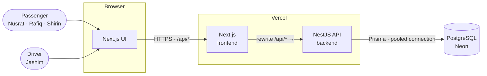
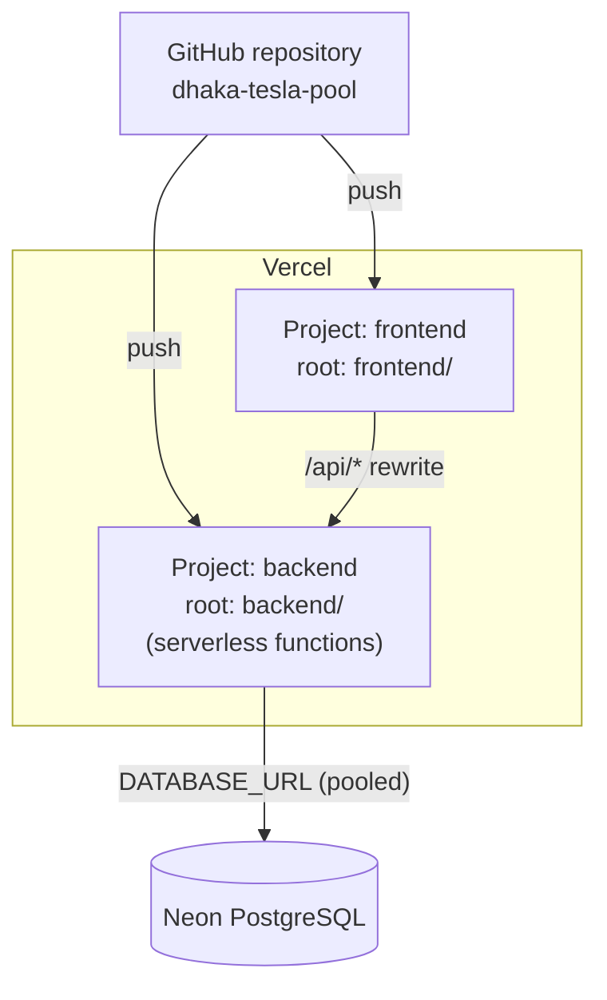
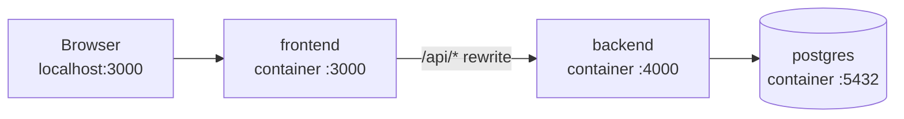
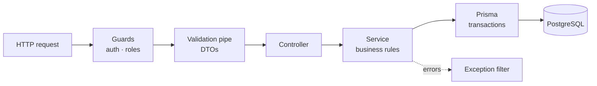
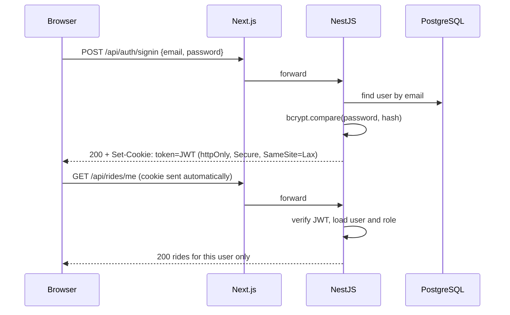

# Architecture

| | |
|---|---|
| **Document** | Architecture |
| **Project** | Dhaka Tesla Pool — MVP |
| **Related** | [Assumptions](assumptions.md) · [Fare Model](fare-model.md) · [ERD](erd.md) · [API](api.md) |

---

## Contents

1. [Overview](#1-overview)
2. [System Context](#2-system-context)
3. [Deployment](#3-deployment)
4. [Backend Design](#4-backend-design)
5. [Frontend Design](#5-frontend-design)
6. [Authentication](#6-authentication)
7. [Ride State Machine](#7-ride-state-machine)
8. [Concurrency & Data Consistency](#8-concurrency--data-consistency)
9. [Error Handling](#9-error-handling)
10. [Logging, Health & Security](#10-logging-health--security)
11. [What Is Deliberately Not Used](#11-what-is-deliberately-not-used)
12. [Trade-offs & Known Limitations](#12-trade-offs--known-limitations)

---

## 1. Overview

Dhaka Tesla Pool is a **three-tier web application**: a Next.js frontend, a NestJS REST API, and a PostgreSQL database. The frontend and backend live in one repository and are deployed as two independent services.

| Layer | Technology | Responsibility |
|---|---|---|
| Frontend | Next.js (App Router), TanStack Query, Tailwind CSS, shadcn/ui | Screens, forms, polling ride status |
| Backend | NestJS, Prisma, class-validator | Auth, validation, business rules, state machine, pooling, fares |
| Database | PostgreSQL | Source of truth; enforces integrity with constraints and row locks |

**Design principle:** all business rules live in the backend. The database is the final guard for anything that must never be violated, such as seat capacity. The frontend only displays state and sends user intent.

---

## 2. System Context



| Hop | Protocol | Notes |
|---|---|---|
| Browser → Next.js | HTTPS | Pages, static assets, and all `/api/*` calls go to the frontend's domain. |
| Next.js → NestJS | HTTPS (rewrite) | Next.js forwards `/api/*` to the backend, so the browser sees a **single origin** and the auth cookie works without cross-site settings. |
| NestJS → PostgreSQL | TCP (TLS) | Prisma uses Neon's pooled connection string at runtime and the direct one for migrations. |

---

## 3. Deployment

### 3.1 Production (Vercel + Neon, free tiers)



- One repository, **two Vercel projects**, each with its own root directory. A push rebuilds only the project whose files changed.
- The backend runs as **serverless functions**: instances start on demand and may be cold after idle periods.
- Migrations run against Neon's **direct** connection (`DIRECT_URL`); the app uses the **pooled** one (`DATABASE_URL`) so short-lived functions don't exhaust connections.

### 3.2 Local (Docker Compose)



`docker compose up` starts the stack in order: `postgres` becomes healthy, a one-off `migrate` container applies migrations and seeds the story cast (idempotently) and exits, then `backend` starts, and `frontend` starts once the backend's health check passes.

---

## 4. Backend Design

### 4.1 Layers



| Layer | Does | Does not |
|---|---|---|
| **Guards** | Verify the JWT cookie and the user's role. | Check ownership of a specific ride. |
| **DTOs + validation pipe** | Reject malformed input (types, ranges, enums) before any code runs. | Apply business rules. |
| **Controllers** | Map HTTP to service calls; no logic. | Touch the database. |
| **Services** | Own every business rule: ownership, state transitions, matching, fares. | Know about HTTP. |
| **Prisma** | Run queries and transactions. | Decide anything. |

### 4.2 Modules

| Module | Folder | Responsibility |
|---|---|---|
| `AuthModule` | `backend/src/auth` | Sign up, sign in, sign out, JWT cookie, guards |
| `UsersModule` | `backend/src/users` | User lookup, current profile |
| `VehiclesModule` | `backend/src/vehicles` | Driver's vehicle and capacity |
| `ZonesModule` | `backend/src/zones` | Zone list and distance lookup |
| `FaresModule` | `backend/src/fares` | Pure fare calculation (no database access) |
| `RidesModule` | `backend/src/rides` | Passenger requests, cancellation, history |
| `PoolsModule` | `backend/src/pools` | Matching, seat reservation, fare locking |
| `DriverModule` | `backend/src/driver` | Online/offline, accept, arrive/start/complete |
| `PrismaModule` | `backend/src/prisma` | Shared database client |
| `common` | `backend/src/common` | Decorators, exception filter, logging interceptor |

`FaresModule` is kept free of database access on purpose, so the fare rules can be unit-tested with plain inputs.

### 4.3 Why REST

| Option | Verdict | Reason |
|---|---|---|
| **REST** | **Chosen** | Resources map naturally (rides, pools, zones); state changes are explicit actions (`POST /rides/:id/cancel`); easy to test with Supertest and document with Swagger. |
| GraphQL | Not chosen | Flexible querying isn't needed for a handful of fixed screens, and it complicates per-field authorization. |
| tRPC | Not chosen | Couples the frontend and backend types tightly; the brief treats them as separate layers. |

---

## 5. Frontend Design

| Area | Choice |
|---|---|
| Routing | App Router: `(auth)/login`, `(auth)/signup`, `passenger/*`, `driver/*` |
| Data fetching | TanStack Query: caching, loading/error states, and `refetchInterval` for live status |
| Live updates | Ride status polled every 3–5 seconds while a ride is active; polling stops on `COMPLETED` or `CANCELLED` |
| Access control | Route groups check the current user's role and redirect; the backend enforces it again |
| UI | Tailwind CSS + shadcn/ui components; every screen has loading, error and empty states |

The frontend never calculates fares or decides state; it displays what the API returns.

---

## 6. Authentication



| Decision | Reason |
|---|---|
| JWT in an **httpOnly** cookie | JavaScript cannot read it, which limits the damage from XSS. |
| `SameSite=Lax` | Blocks the cookie on cross-site POSTs, protecting against CSRF. |
| **bcrypt** password hashing | Slow by design; industry standard. |
| Role stored in the token | Guards check roles without a database call; ownership is still checked in services. |
| Token lifetime 1 day | Short enough to limit misuse, long enough for a demo session. No refresh tokens in the MVP. |

---

## 7. Ride State Machine

All transitions go through a single function that holds the allowed-transition table from [assumptions.md](assumptions.md#52-allowed-transitions). Services never set a status directly.

```
assertTransition(current, next, actor)  →  ok  |  409 Conflict
```

Each transition is applied with a **conditional update** so a stale request cannot overwrite a newer status:

```sql
UPDATE ride_requests
SET status = 'CANCELLED'
WHERE id = $1 AND status IN ('REQUESTED', 'MATCHED', 'DRIVER_ARRIVED');
-- 0 rows updated → the ride already moved on → 409 Conflict
```

Every successful transition inserts a row into the status history table in the **same transaction**.

---

## 8. Concurrency & Data Consistency

### 8.1 The Problem

Bullet has **one seat left**. Nusrat and Shirin request at almost the same instant, and both read `occupiedSeats = 2, capacity = 3`. Without protection, both reservations succeed and Bullet carries four passengers.

### 8.2 The Solution: Row Lock + Constraint

Seat reservation runs inside one database transaction that **locks the pool row** before reading it.

```mermaid
sequenceDiagram
    participant N as Nusrat's request
    participant S as Shirin's request
    participant DB as PostgreSQL

    N->>DB: BEGIN; SELECT … FROM pools WHERE id = 7 FOR UPDATE
    Note over DB: pool 7 locked by Nusrat
    S->>DB: BEGIN; SELECT … FROM pools WHERE id = 7 FOR UPDATE
    Note over S,DB: waits for the lock
    N->>DB: occupied 2 + 1 ≤ 3 ✓ → insert member, occupied = 3
    N->>DB: COMMIT (lock released)
    DB-->>S: returns row: occupied = 3
    S->>DB: occupied 3 + 1 > 3 ✗ → ROLLBACK
    Note over S: Not added to the pool; request stays REQUESTED<br/>for another driver (a driver accept would get 409)
```

```sql
BEGIN;
SELECT status, occupied_seats, capacity
FROM pools WHERE id = $poolId
FOR UPDATE;                                   -- other transactions wait here

-- in the service: status must be MATCHED,
-- occupied_seats + $seats <= capacity, detour rule must hold

INSERT INTO pool_members (...);
UPDATE pools SET occupied_seats = occupied_seats + $seats WHERE id = $poolId;
UPDATE ride_requests SET status = 'MATCHED' WHERE id = $rideId AND status = 'REQUESTED';
INSERT INTO ride_status_history (...);
COMMIT;
```

### 8.3 Defence in Depth

| Layer | Guard | Catches |
|---|---|---|
| Service | Capacity and status checks after `FOR UPDATE` | The normal race between two requests |
| Database | `CHECK (occupied_seats <= capacity)` on `pools` | Any code path that forgets the lock |
| Database | Partial unique index: one active request per passenger | Double-submit of the same request |
| Database | Partial unique index: one active pool per driver | A driver accepting two requests at once |
| Database | Conditional `UPDATE … WHERE status = …` | Two drivers accepting the same request; stale state changes |

### 8.4 Why This Approach

| Option | Verdict | Reason |
|---|---|---|
| **Pessimistic row lock (`FOR UPDATE`)** | **Chosen** | Simple, correct, and contention is tiny: at most 3 seats per pool, so few requests ever wait on the same row. |
| Optimistic locking (version column + retry) | Not chosen | Correct too, but needs retry logic in every caller for no benefit at this scale. |
| `SERIALIZABLE` isolation | Not chosen | Correct, but raises serialization failures that also require retries across all transactions. |
| Application-level mutex | Rejected | Breaks as soon as there is more than one serverless instance. |

### 8.5 At Larger Scale

| Change | Why |
|---|---|
| Partition matching by pickup zone | Requests in different zones never compete for the same pools. |
| Move matching to a per-zone queue worker | Serialises matching per zone without holding database locks during HTTP requests. |
| Idempotency keys on ride requests | Safe client retries over unreliable mobile networks. |
| Atomic seat counters in Redis, reconciled to PostgreSQL | Only if database lock contention becomes measurable. |

Detailed scaling reasoning is in [scaling.md](scaling.md).

---

## 9. Error Handling

A global exception filter returns every error in one shape:

```json
{
  "statusCode": 409,
  "error": "Conflict",
  "message": "No seats left in this pool",
  "requestId": "b3f1c2e0-…"
}
```

| Status | When |
|---|---|
| `400 Bad Request` | Validation failed (e.g. 0 seats, same pickup and destination) |
| `401 Unauthorized` | Missing or invalid token |
| `403 Forbidden` | Wrong role, or not the owner of the ride/pool |
| `404 Not Found` | Resource does not exist |
| `409 Conflict` | Invalid state transition, no seats left, already has an active ride |
| `500 Internal Server Error` | Unexpected failure; details logged, never returned |

---

## 10. Logging, Health & Security

| Area | Approach |
|---|---|
| **Request logging** | Each request gets a `requestId`, logged with method, path, status, duration and user ID. The same ID is returned in error responses. |
| **Business events** | Seat reservations, state transitions and fare locks are logged with ride and pool IDs. |
| **Health check** | `GET /api/health` checks the database connection; used by Docker Compose. |
| **Input validation** | Global validation pipe with whitelisting; unknown fields are rejected. |
| **Authorization** | Role guards on every route; ownership checked in services. |
| **HTTP headers** | Helmet sets secure defaults. |
| **Rate limiting** | Sign-in: 5 attempts per minute per client IP **and** email; sign-up: 20 per minute. Keyed on email too because behind the Next.js rewrite every request reaches the API from the frontend's address, so an IP-only key would make all users share one limit. |
| **Secrets** | Only in environment variables; `.env.example` holds placeholders. |
| **Data exposure** | Password hashes are never returned; passengers never see other passengers' fares. |

---

## 11. What Is Deliberately Not Used

| Technology | Why not |
|---|---|
| Microservices | One team, one small domain; a modular monolith is simpler to build, test and deploy. |
| Redis / cache | PostgreSQL handles the load; no measured need. |
| Message queues (Kafka, RabbitMQ) | Matching is synchronous and fast; no background work to distribute yet. |
| WebSockets | Not supported on Vercel's serverless functions; polling is sufficient for a ride status that changes a few times per trip. |
| Kubernetes | Vercel handles scaling for the MVP. |
| Map / routing API | The brief advises against it; zones and a distance table are enough. |

---

## 12. Trade-offs & Known Limitations

| Trade-off | Impact | Mitigation |
|---|---|---|
| Serverless backend | Cold starts can add a few seconds after idle periods. | Acceptable for an MVP; a long-running server removes it. |
| Polling instead of push | Status changes appear with up to ~5 seconds' delay. | Polling interval is short and stops when the ride ends. |
| Zone-level geography | Matching ignores exact addresses and real traffic. | Documented in [assumptions.md](assumptions.md); a routing service is a future improvement. |
| Single region | Latency depends on the Vercel and Neon regions chosen. | Both set to the region closest to Dhaka available on the free tier. |
| No refresh tokens | Users sign in again after one day. | Acceptable for an MVP. |
| In-memory rate-limit counters | Each serverless instance counts separately, so the limit is per instance rather than global. | A shared store (e.g. Redis) when the API scales out. |
| Rate limits can't see the client's IP | Behind the Next.js rewrite the API sees the frontend's address, so limits are effectively per email: sign-up with new emails isn't limited, and five bad attempts a minute can briefly lock one account's sign-in. | Forward the client IP from the frontend (or an edge proxy) and trust that hop, then add an IP-only limit. |
