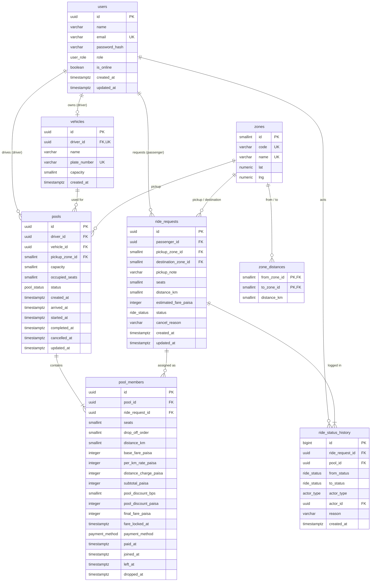

# Database Design & ERD

| | |
|---|---|
| **Document** | Database Design & ERD |
| **Project** | Dhaka Tesla Pool — MVP |
| **Related** | [Assumptions](assumptions.md) · [Fare Model](fare-model.md) · [Architecture](architecture.md) · [API](api.md) |

---

## Contents

1. [Overview](#1-overview)
2. [Entity Relationship Diagram](#2-entity-relationship-diagram)
3. [Conventions](#3-conventions)
4. [Enums](#4-enums)
5. [Tables](#5-tables)
6. [Integrity Rules](#6-integrity-rules)
7. [Indexes](#7-indexes)
8. [Example: Nusrat and Rafiq in the Database](#8-example-nusrat-and-rafiq-in-the-database)
9. [Seed Data](#9-seed-data)
10. [Design Decisions](#10-design-decisions)

---

## 1. Overview

PostgreSQL is the single source of truth. Eight tables cover the domain:

| Table | Purpose | Key relationships |
|---|---|---|
| `users` | Passengers and drivers | — |
| `vehicles` | A driver's Tesla and its seat capacity | 1 per driver |
| `zones` | The 14 Dhaka areas | — |
| `zone_distances` | Distance between every pair of zones | 2 zones per row |
| `ride_requests` | One passenger's trip request and its status | passenger, 2 zones |
| `pools` | One trip by one vehicle, carrying one or more requests | driver, vehicle, pickup zone |
| `pool_members` | A request's seat in a pool, with its fare breakdown | pool, ride request |
| `ride_status_history` | Every status change, for audit | ride request, actor |

A **ride request** is what a passenger asks for; a **pool** is what a driver runs. `pool_members` joins them and is where seats and fares are recorded.

---

## 2. Entity Relationship Diagram

---

## 3. Conventions

| Convention | Rule |
|---|---|
| **Naming** | Tables and columns in `snake_case`; tables plural. Prisma models are `PascalCase` singular (`RideRequest`) with fields in `camelCase`, mapped with `@@map` / `@map`. |
| **Primary keys** | `uuid` for user-facing records (users, rides, pools); small integers for fixed reference data (zones). |
| **Timestamps** | `timestamptz`, stored in UTC. `created_at` defaults to `now()`; `updated_at` is maintained by Prisma. |
| **Money** | `integer` paisa, suffix `_paisa`. Percentages as `smallint` basis points, suffix `_bps`. |
| **Foreign keys** | `ON DELETE RESTRICT` everywhere. Rides and history are never deleted; records are cancelled, not removed. |
| **Nullable columns** | Only where a value genuinely does not exist yet (e.g. `final_fare_paisa` before the trip starts). |

---

## 4. Enums

| Enum | Values |
|---|---|
| `user_role` | `PASSENGER`, `DRIVER` |
| `ride_status` | `REQUESTED`, `MATCHED`, `DRIVER_ARRIVED`, `STARTED`, `COMPLETED`, `CANCELLED` |
| `pool_status` | `MATCHED`, `DRIVER_ARRIVED`, `STARTED`, `COMPLETED`, `CANCELLED` |
| `actor_type` | `PASSENGER`, `DRIVER`, `SYSTEM` |
| `payment_method` | `CASH` |

`pool_status` has no `REQUESTED`: a pool only exists once a driver has accepted a request. `payment_method` has one value today so a wallet can be added without a schema redesign.

---

## 5. Tables

### 5.1 `users`

Everyone who signs in. One role per account.

| Column | Type | Null | Default | Notes |
|---|---|:---:|---|---|
| `id` | `uuid` | | `gen_random_uuid()` | PK |
| `name` | `varchar(100)` | | | Display name, e.g. "Nusrat" |
| `email` | `varchar(255)` | | | Unique; stored lowercase |
| `password_hash` | `varchar(255)` | | | bcrypt hash; never returned by the API |
| `role` | `user_role` | | | `PASSENGER` or `DRIVER` |
| `is_online` | `boolean` | | `false` | Only meaningful for drivers |
| `created_at` | `timestamptz` | | `now()` | |
| `updated_at` | `timestamptz` | | `now()` | |

**Constraints:** `UNIQUE (email)` · `CHECK (email = lower(email))` · `CHECK (role = 'DRIVER' OR is_online = false)`

### 5.2 `vehicles`

A driver's Tesla. Capacity is fixed per vehicle.

| Column | Type | Null | Default | Notes |
|---|---|:---:|---|---|
| `id` | `uuid` | | `gen_random_uuid()` | PK |
| `driver_id` | `uuid` | | | FK → `users.id`; unique, one vehicle per driver |
| `name` | `varchar(50)` | | | e.g. "Bullet" |
| `plate_number` | `varchar(20)` | | | Unique |
| `capacity` | `smallint` | | | Passenger seats, e.g. 3 |
| `created_at` | `timestamptz` | | `now()` | |

**Constraints:** `UNIQUE (driver_id)` · `UNIQUE (plate_number)` · `CHECK (capacity BETWEEN 1 AND 6)`

The owner must have role `DRIVER`; PostgreSQL cannot check another table's column in a `CHECK`, so this is enforced in the service when a vehicle is created.

### 5.3 `zones`

Reference data for the 14 zones in [assumptions.md](assumptions.md#31-zones).

| Column | Type | Null | Default | Notes |
|---|---|:---:|---|---|
| `id` | `smallint` | | identity | PK |
| `code` | `varchar(10)` | | | Unique, e.g. `BAN` |
| `name` | `varchar(50)` | | | Unique, e.g. "Banani" |
| `lat` | `numeric(9,6)` | | | Zone centre, for an optional map |
| `lng` | `numeric(9,6)` | | | Zone centre, for an optional map |

### 5.4 `zone_distances`

The distance table, stored in **both directions** so a lookup is a single primary-key read.

| Column | Type | Null | Default | Notes |
|---|---|:---:|---|---|
| `from_zone_id` | `smallint` | | | PK, FK → `zones.id` |
| `to_zone_id` | `smallint` | | | PK, FK → `zones.id` |
| `distance_km` | `smallint` | | | Whole kilometres |

**Constraints:** `PRIMARY KEY (from_zone_id, to_zone_id)` · `CHECK (from_zone_id <> to_zone_id)` · `CHECK (distance_km > 0)`

### 5.5 `ride_requests`

One passenger's trip. Its status is the passenger's view of the ride.

| Column | Type | Null | Default | Notes |
|---|---|:---:|---|---|
| `id` | `uuid` | | `gen_random_uuid()` | PK |
| `passenger_id` | `uuid` | | | FK → `users.id` |
| `pickup_zone_id` | `smallint` | | | FK → `zones.id` |
| `destination_zone_id` | `smallint` | | | FK → `zones.id` |
| `pickup_note` | `varchar(200)` | ✓ | | Free text, e.g. "Road 11, near the mosque" |
| `seats` | `smallint` | | | 1–3 |
| `distance_km` | `smallint` | | | Copied from `zone_distances` at request time |
| `estimated_fare_paisa` | `integer` | | | Solo fare shown to the passenger |
| `status` | `ride_status` | | `REQUESTED` | |
| `cancel_reason` | `varchar(200)` | ✓ | | Set when cancelled |
| `created_at` | `timestamptz` | | `now()` | |
| `updated_at` | `timestamptz` | | `now()` | |

**Constraints:** `CHECK (pickup_zone_id <> destination_zone_id)` · `CHECK (seats BETWEEN 1 AND 3)` · `CHECK (distance_km > 0)` · `CHECK (estimated_fare_paisa >= 0)` · one active request per passenger (see [§6](#6-integrity-rules))

### 5.6 `pools`

One trip by one vehicle. Its status is the driver's view of the ride.

| Column | Type | Null | Default | Notes |
|---|---|:---:|---|---|
| `id` | `uuid` | | `gen_random_uuid()` | PK |
| `driver_id` | `uuid` | | | FK → `users.id` |
| `vehicle_id` | `uuid` | | | FK → `vehicles.id` |
| `pickup_zone_id` | `smallint` | | | FK → `zones.id`; all members share it |
| `capacity` | `smallint` | | | Copied from the vehicle when the pool is created |
| `occupied_seats` | `smallint` | | `0` | Sum of active members' seats |
| `status` | `pool_status` | | `MATCHED` | |
| `created_at` | `timestamptz` | | `now()` | When the driver accepted |
| `arrived_at` | `timestamptz` | ✓ | | |
| `started_at` | `timestamptz` | ✓ | | Fares are locked at this moment |
| `completed_at` | `timestamptz` | ✓ | | |
| `cancelled_at` | `timestamptz` | ✓ | | |
| `updated_at` | `timestamptz` | | `now()` | |

**Constraints:** `CHECK (capacity BETWEEN 1 AND 6)` · `CHECK (occupied_seats >= 0 AND occupied_seats <= capacity)` · one active pool per driver (see [§6](#6-integrity-rules))

### 5.7 `pool_members`

A ride request's seat in a pool. Holds the drop-off order and the full fare breakdown described in [fare-model.md](fare-model.md#7-stored-fare-breakdown).

| Column | Type | Null | Default | Notes |
|---|---|:---:|---|---|
| `id` | `uuid` | | `gen_random_uuid()` | PK |
| `pool_id` | `uuid` | | | FK → `pools.id` |
| `ride_request_id` | `uuid` | | | FK → `ride_requests.id` |
| `seats` | `smallint` | | | Copied from the request |
| `drop_off_order` | `smallint` | | | 1 = first drop-off; recalculated when members join or leave |
| `distance_km` | `smallint` | | | Direct distance charged |
| `base_fare_paisa` | `integer` | ✓ | | Set when the fare is locked |
| `per_km_rate_paisa` | `integer` | ✓ | | Set when the fare is locked |
| `distance_charge_paisa` | `integer` | ✓ | | Set when the fare is locked |
| `subtotal_paisa` | `integer` | ✓ | | Set when the fare is locked |
| `pool_discount_bps` | `smallint` | ✓ | | 0 alone, 2000 with 2 passengers, 3000 with 3 or more |
| `pool_discount_paisa` | `integer` | ✓ | | Set when the fare is locked |
| `final_fare_paisa` | `integer` | ✓ | | What the passenger pays |
| `fare_locked_at` | `timestamptz` | ✓ | | Equals the pool's `started_at` |
| `payment_method` | `payment_method` | | `CASH` | |
| `paid_at` | `timestamptz` | ✓ | | Set when the passenger is dropped off (their ride is `COMPLETED`) |
| `joined_at` | `timestamptz` | | `now()` | |
| `left_at` | `timestamptz` | ✓ | | Set if the passenger cancels or the driver cancels the pool |
| `dropped_at` | `timestamptz` | ✓ | | Set when the driver drops this passenger off during the trip |

**Constraints:**
- `CHECK (seats BETWEEN 1 AND 3)` · `CHECK (drop_off_order >= 1)`
- All fare columns `>= 0` · `CHECK (pool_discount_bps BETWEEN 0 AND 10000)` · `CHECK (final_fare_paisa <= subtotal_paisa)`
- `CHECK ((final_fare_paisa IS NULL) = (fare_locked_at IS NULL))` — a fare is either fully locked or not at all
- `CHECK (dropped_at IS NULL OR left_at IS NULL)` — someone who left the pool can't be dropped off
- `CHECK (dropped_at IS NULL OR fare_locked_at IS NOT NULL)` — drop-offs happen only after the fare is locked at the start
- A request is an active member of at most one pool (see [§6](#6-integrity-rules))

A request can appear in more than one row over its lifetime: if a driver cancels a pool, the member row gets `left_at`, the request returns to `REQUESTED`, and it may later join another pool.

### 5.8 `ride_status_history`

Append-only audit log. Rows are inserted in the same transaction as the change they describe and are never updated or deleted.

| Column | Type | Null | Default | Notes |
|---|---|:---:|---|---|
| `id` | `bigint` | | identity | PK |
| `ride_request_id` | `uuid` | | | FK → `ride_requests.id` |
| `pool_id` | `uuid` | ✓ | | FK → `pools.id`; the pool involved, if any |
| `from_status` | `ride_status` | ✓ | | `NULL` for the initial `REQUESTED` row |
| `to_status` | `ride_status` | | | |
| `actor_type` | `actor_type` | | | Who caused it |
| `actor_id` | `uuid` | ✓ | | FK → `users.id`; `NULL` when `actor_type = SYSTEM` |
| `reason` | `varchar(200)` | ✓ | | e.g. "Driver cancelled: vehicle breakdown" |
| `created_at` | `timestamptz` | | `now()` | |

**Constraints:** `CHECK ((actor_type = 'SYSTEM') = (actor_id IS NULL))`

---

## 6. Integrity Rules

Rules the database enforces on its own, so no code path can break them.

| Rule | Mechanism |
|---|---|
| Seats never exceed capacity | `CHECK (occupied_seats <= capacity)` on `pools`, plus a `FOR UPDATE` row lock during reservation ([architecture.md](architecture.md#8-concurrency--data-consistency)) |
| One active request per passenger | `UNIQUE (passenger_id) WHERE status IN ('REQUESTED','MATCHED','DRIVER_ARRIVED','STARTED')` |
| One active pool per driver | `UNIQUE (driver_id) WHERE status IN ('MATCHED','DRIVER_ARRIVED','STARTED')` |
| A request is in at most one pool at a time | `UNIQUE (ride_request_id) WHERE left_at IS NULL` on `pool_members` |
| One vehicle per driver | `UNIQUE (driver_id)` on `vehicles` |
| No negative money | `CHECK (... >= 0)` on every `_paisa` column |
| Pickup differs from destination | `CHECK (pickup_zone_id <> destination_zone_id)` |
| History is never lost | `ON DELETE RESTRICT` on every foreign key |

**Implementation note:** Prisma's schema language cannot express `CHECK` constraints or partial unique indexes. They are added in a hand-written SQL migration alongside the generated one, and covered by tests that try to violate them.

---

## 7. Indexes

Each index exists for a specific query.

| Index | Query it serves |
|---|---|
| `ride_requests (passenger_id, created_at DESC)` | A passenger's ride history |
| `ride_requests (status, pickup_zone_id, created_at)` | Open requests shown to online drivers, oldest first |
| `pools (status, pickup_zone_id, created_at)` | Finding open pools to join during matching |
| `pools (driver_id, created_at DESC)` | A driver's trip history |
| `pool_members (pool_id)` | Members of a pool |
| `pool_members (ride_request_id)` | The pool a request belongs to |
| `ride_status_history (ride_request_id, created_at)` | A ride's timeline |
| Partial unique indexes in [§6](#6-integrity-rules) | Also serve "does this user have an active ride/pool?" lookups |

Primary keys and unique constraints (`users.email`, `vehicles.driver_id`, `zone_distances` PK) are indexed automatically.

---

## 8. Example: Nusrat and Rafiq in the Database

The state after Jashim completes the shared trip from Banani.

**`pools`**

| id | driver | pickup | capacity | occupied_seats | status |
|---|---|---|---:|---:|---|
| `p-7` | Jashim | BAN | 3 | 2 | `COMPLETED` |

**`ride_requests`**

| id | passenger | pickup → destination | seats | distance_km | estimated_fare_paisa | status |
|---|---|---|---:|---:|---:|---|
| `r-1` | Nusrat | BAN → MOH | 1 | 3 | 7500 | `COMPLETED` |
| `r-2` | Rafiq | BAN → GL1 | 1 | 4 | 9000 | `COMPLETED` |

**`pool_members`**

| pool | request | drop_off_order | subtotal_paisa | pool_discount_paisa | final_fare_paisa |
|---|---|---:|---:|---:|---:|
| `p-7` | `r-1` (Nusrat) | 1 | 7500 | 1500 | **6000** |
| `p-7` | `r-2` (Rafiq) | 2 | 9000 | 1800 | **7200** |

**`ride_status_history`** for Nusrat's ride

| from | to | actor | reason |
|---|---|---|---|
| — | `REQUESTED` | Nusrat | |
| `REQUESTED` | `MATCHED` | Jashim | Accepted request |
| `MATCHED` | `DRIVER_ARRIVED` | Jashim | |
| `DRIVER_ARRIVED` | `STARTED` | Jashim | Fare locked: ৳60 |
| `STARTED` | `COMPLETED` | Jashim | Paid in cash |

Rafiq's history has the same shape, except his `MATCHED` row has actor `SYSTEM` and reason "Joined pool p-7".

---

## 9. Seed Data

| Table | Rows | Content |
|---|---:|---|
| `users` | 4 | Jashim (driver), Nusrat, Rafiq, Shirin (passengers) |
| `vehicles` | 1 | Bullet, capacity 3, owned by Jashim |
| `zones` | 14 | All zones from [assumptions.md](assumptions.md#31-zones) |
| `zone_distances` | 182 | 91 zone pairs × 2 directions |

No rides are seeded; the demo creates them live. Demo passwords are listed in the README and are for local and demo use only.

---

## 10. Design Decisions

| Decision | Alternative | Why this way |
|---|---|---|
| Separate `ride_requests` and `pools` | A single `rides` table | A passenger's request exists before any driver accepts it, and one pool carries several requests. Separate tables keep each status meaningful. |
| `capacity` copied onto `pools` | Read it from `vehicles` | A `CHECK` constraint can only see its own row. The copy lets PostgreSQL enforce capacity directly. |
| `occupied_seats` stored on `pools` | Sum `pool_members.seats` on every read | The stored counter is what the row lock protects and the `CHECK` validates; summing would need a lock on many rows instead of one. |
| Fare breakdown stored per member | Store only the final amount | Any fare can be explained and re-verified later, even if rates change. |
| `distance_km` copied onto requests | Always join `zone_distances` | The trip keeps its distance even if the table is corrected later. |
| `left_at` instead of deleting members | Delete the row on cancellation | Keeps the full record of who was in which pool. |
| History table instead of status timestamps only | `requested_at`, `matched_at`, … on `ride_requests` | Captures actor and reason, and handles repeated states (e.g. back to `REQUESTED` after a driver cancels). |
| UUID primary keys | Auto-increment integers | Not guessable in URLs and safe to generate anywhere; ownership is still checked on every request. |
